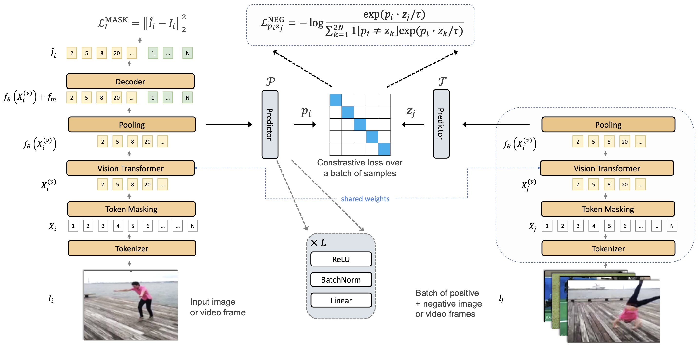

# ViC-MAE
Official PyTorch/GPU codebase for [ViC-MAE: Self-Supervised Representation Learning from Images and Video with Contrastive Masked Autoencoders](https://arxiv.org/abs/2303.12001v2).



This repo is based on:
- [MAE](https://github.com/facebookresearch/mae)
- [MAE-ST](https://github.com/facebookresearch/mae_st)
- [CAN](https://github.com/bwconrad/can)

## Requirements
Create a conda environment and install the requirements:
```
conda create -y -n vicmae python=3.9 cupy pkg-config compilers libjpeg-turbo libwebp opencv=4.7.0 numba ffmpeg av tmux cudatoolkit=11.8 -c conda-forge
conda activate vicmae
pip install torch torchvision torchaudio --index-url https://download.pytorch.org/whl/cu118
pip install wandb ffmpeg-python git+https://github.com/rwightman/pytorch-image-models glances[all]
pip install ffcv
```

## Checkpoints

The following table provides the strongest pre-trained checkpoints used in the paper. 

| Model | Dataset | Epochs | Batch Size | Download |
| :---: | :---: | :---: | :---: | :---: |
| ViC-MAE-B/16 | IN1K + K400 | 800 |  4096 | [Link](https://drive.google.com/file/d/1p879SxrProg_ttPKvVXqJNpUvuCLkjAf/view?usp=sharing) |
| ViC-MAE-B/16 | IN1K + K400 + K600 + K700 +MiT | 800 |  4096 | [Link](https://drive.google.com/file/d/1cwa3dX68JKha8JIor7nX0tN-_g0bklq-/view?usp=sharing) |
| ViC-MAE-L/16 | IN1K + K400 | 800 |  4096 | [Link](https://drive.google.com/file/d/17KdKAb2CVOlAHvy_M1pskWrrI3K3tgjE/view?usp=sharing) |
| ViC-MAE-L/16 | IN1K + K400 + K600 + K700 +MiT | 800 |  4096 | [Link](https://drive.google.com/file/d/1EqR1d1bOR0gFImUR_QEs7jFXokVmzO-y/view?usp=sharing) |


## Training
See [PRETRAIN.md](PRETRAIN.md) for pre-training instructions.
## Fine-tuning
See [FINETUNE.md](FINETUNE.md) for fine-tuning instructions.
## Citation
```
@article{hernandez2023visual,
  title={Visual Representation Learning from Unlabeled Video using Contrastive Masked Autoencoders},
  author={Hernandez, Jefferson and Villegas, Ruben and Ordonez, Vicente},
  journal={arXiv preprint arXiv:2303.12001},
  year={2023}
}
```